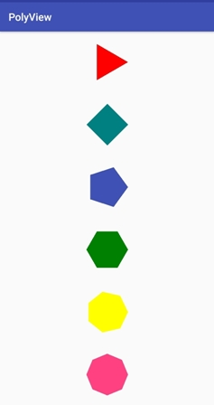

# PolyView
A custom view for creating polygons. Custom view takes attributes like no of sides, radius for area to in which view should be drawan & color for the view.

This is how the result looks like in this demo.

 😍 Happy Coding 😍
